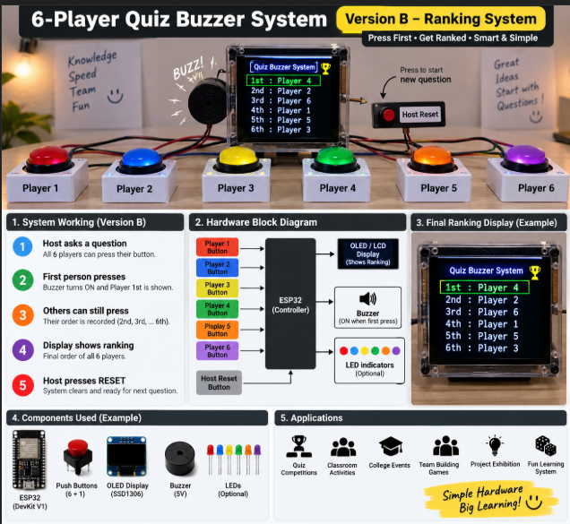

# 6-Player Quiz Buzzer System ⚡🎯

**Version B — Ranking System**

> Press first. Get ranked. Smart & Simple.



---

## How It Works

| Step | What happens |
|------|-------------|
| 1 | Host asks a question |
| 2 | First player presses → buzzer sounds, ranked **1st** |
| 3 | Others can still press → order recorded (2nd, 3rd… 6th) |
| 4 | OLED shows full ranking of all 6 players |
| 5 | Host presses RESET → system clears, ready for next question |

---

## Hardware

| Component | Qty | Note |
|-----------|-----|------|
| ESP32 DevKit V1 | 1 | Microcontroller |
| Push buttons | 7 | 6 players + 1 host reset |
| OLED Display SSD1306 (128×64) | 1 | I2C, shows ranking |
| Active buzzer (5V) | 1 | Sounds on first press only |
| LEDs (optional) | 6 | One per player, colored |
| Breadboard + jumpers | — | |

---

## Pin Assignments

| Player | Button Pin |
|--------|-----------|
| Player 1 | GPIO 13 |
| Player 2 | GPIO 14 |
| Player 3 | GPIO 27 |
| Player 4 | GPIO 26 |
| Player 5 | GPIO 25 |
| Player 6 | GPIO 33 |
| Host Reset | GPIO 32 |
| Buzzer | GPIO 23 |
| OLED SDA | GPIO 21 |
| OLED SCL | GPIO 22 |

All player buttons and reset use **INPUT_PULLUP** — connect one side to GPIO, other side to GND. No external resistors needed.

---

## OLED Display Output

```
Quiz Buzzer System
──────────────────
1st : Player 4
2nd : Player 2
3rd : Player 6
4th : Player 1
5th : Player 5
6th : Player 3
```

---

## Libraries

Install via Arduino Library Manager:
- `Adafruit SSD1306`
- `Adafruit GFX Library`
- `Adafruit BusIO` (auto-installs)

---

## Firmware

| File | Description |
|------|-------------|
| [firmware/quiz_buzzer_v2/quiz_buzzer_v2.ino](firmware/quiz_buzzer_v2/quiz_buzzer_v2.ino) | Full working firmware — ranking, debounce, OLED, buzzer, reset |

---

## Applications

- 🏆 Quiz competitions
- 🏫 Classroom activities
- 🎓 College events & exhibitions
- 👥 Team building games
- 🎮 Fun learning system

---

## Status

- ✅ Firmware complete
- ✅ 6-player ranking logic
- ✅ OLED display output
- ✅ Debounced button reads
- ✅ Buzzer on first press only
- ✅ Double-beep reset confirmation
- 📋 Optional: colored LEDs per player
- 📋 Optional: Version A (first press only, no ranking)

---

Part of [EC Simplified](https://github.com/maruthirm333-prog/ec-simplified) — Maruthi R M
